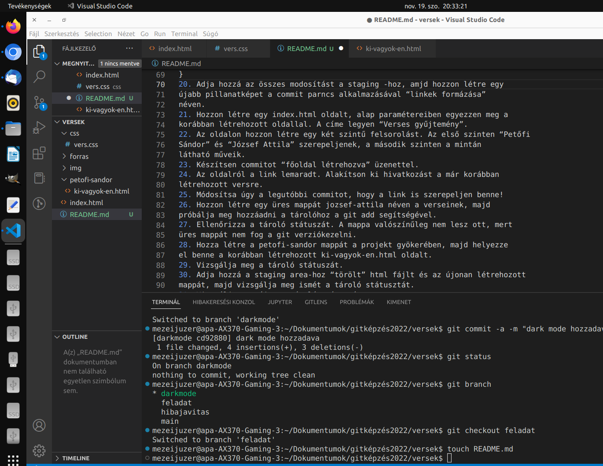

Lehet, hogy nem értem jó. A feladat leírását kell elkészíteni.
Ezt kell elkészíteni?

Versek 1
Egy rövid verses gyűjtemény elkészítése lenne a feladat. A feladat során a git
kezelése le van írva lépésről lépésre, célszerű ezt követni.
1. Hozzon létre egy mappát versek néven. Ez lesz a projekt mappa.
2. Az imént létrehozott mappát alakítsa ki helyi git tárolónak.
3. Nézze meg az aktuális konfigurációt.
4. Állítsa be a frissen létrehozott tárolóra lokálisan a felhasználónevét és
e-mail címét.
5. Ellenőrizze újra az aktuális konfigurációt, hogy sikerült -e beállítani az
adatokat.
6. Hozzon létre a projekt mappában egy forras nevű mappát. Ebbe másolja
be vegyítve az összes verset tartalmazó txt fájlt.
7. Hozzon létre egy img mappát, másolja be ide a képeket.

8. Adja hozzá az összes .txt állományt a tárolóhoz “forrás hozzáadva” megj-
egyzéssel.

9. Adja hozzá a tárolóhoz az összes képet. Figyelem! A képek különböző
kiterjesztésűek, ugyanakkor elvileg más fájl nem lett a projektmappához
hozzáadva. Az commit üzenet legyen “képek hozzáadva”.
10. A projektmappában hozzon létre egy fájlt ki-vagyok-en.html néven. A
fájl egy HTML5 kódolású, oldal legyen utf-8 karakterkódolással, továbbá
állítsa be a nyelvet magyarra.
11. Hozzon létre a tartalomnak egy main elemet, majd illessze be a
ki-vagyok-en.txt tartalmát az oldalba, és tördelje a minta alapján. Az
oldal címe legyen a böngészőfülön is a vers címe!

12. Készítsen commitot a változásokról “ki-vagyok-en.html létrehozva” üzenet-
tel.
13. A projekt mappában hozzon létre egy versek.css fájlt. Ezt kösse össze a
html oldallal, majd végezze el benne az alábbi beállításokat:
body {
background-color: #CD9023;
color: #000;
background-image: url(img/quill.svg);
background-repeat: no-repeat;
background-position: bottom right;
}
main {
background-color: rgba(255, 255, 255, 0.5);
padding: 1rem;
width: 70%;
margin: 0 auto;
}
h1 {
text-align: center;
font-variant: small-caps;
}
p {
text-align: center;
}
14. Ellenőrizze a tároló jelenlegi állapotát. Mely fájlok lettek módosítva, és
melyek az új fájlok?
15. Hozzon létre egy commitot a css fájl létrehozásáról és az oldallal
összekötéséről “alap css létrehozva” üzenettel.
16. Az utolsó, dátumot is tartalmazó bekezdést lással el datum osztállyal.
17. Állítsa be, hogy a datum osztályba sorolt elemek legyenek jobbra igazítva.
18. Készítsen egy commitot külön csak a dátumot érintő változásról a HTML és
CSS fájlt egyszerre adja hozzá! Az üzenet legyen: “datum jobbra igazitva”.
19. Bővítse a css fájlt az alábbi kóddal.
a {
color: #CD4332;
}
a:hover {
color: #600;
}
20. Adja hozzá az összes modosítást a staging -hoz, amjd hozzon létre egy
újabb pillanatképet a commit parncs alkalmazásával “linkek formázása”
néven.
21. Hozzon létre egy index.html oldalt, alap paramétereiben egyezzen meg a
korábban létrehozott oldallal. A címe legyen “Verses gyűjtemény”.
22. Az oldalon hozzon létre egy két szintű felsorolást. Az első szinten “Petőfi
Sándor” és “József Attila” szerepeljenek, a második szinten a mintán
látható műveik.
23. Készítsen commitot “főoldal létrehozva” üzenettel.
24. Az oldalról a link lemaradt. Alakítson ki hivatkozást a már korábban
létrehozott versre.
25. Módosítsa úgy a legutóbbi commitot, hogy a link is szerepeljen benne!
26. Hozzon létre egy üres mappát jozsef-attila néven a verseinek, majd
próbálja meg hozzáadni a tárolóhoz a git add segítségével.
27. Ellenőrizza a tároló státuszát. A mappa valószínűleg nem lesz ott, mert
üres mappát nem fog a git verziókezelni.
28. Hozza létre a petofi-sandor mappát a projekt gyökerében, majd helyezze
el benne a korábban létrehozott ki-vagyok-en.html oldalt.
29. Vizsgálja meg a tároló státuszát.
30. Adja hozzá a staging area-hoz “törölt” html fájlt és az újonan létrehozott
mappát, majd vizsgálja meg ismét a tároló státusztát.
31. Vizsgálja meg újra a tároló státuszát.
32. Hozzon létre egy css mappát, majd mozgassa bele CSS fájlt a git mv
parancs segítségével. A tároló státuszának ismételt vizsgálatakor látszik,
hogy rendszer rögtön tudja, hogy átnevezésről van szó.
33. Mivel a css fájl át lett mozgatva, így a háttérkép hivatkozása már nem
működik, ezt javítsa ki. Továbbá a két HTML fájlban is módosítani kell a
CSS fájl hivatkozását!
34. Mivel a fájlok az átmozgatása után módosítva lettek, így ismét hozzá kell
adni őket a staginig area-hoz.
35. A módosításokat commitolja “átszervezés” üzenettel.
36. A git log, vagy a git shortlog paranccsal ellenőrizhető mik is lettek
végrehajtva a feladat során.